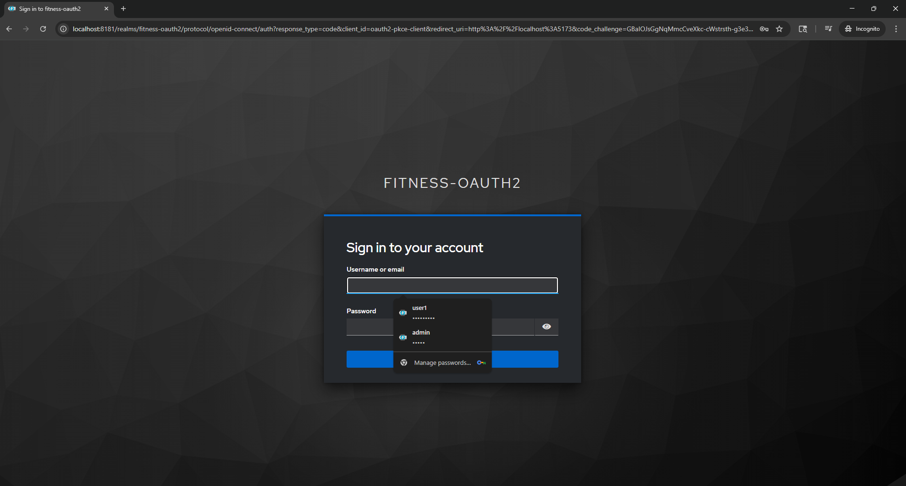
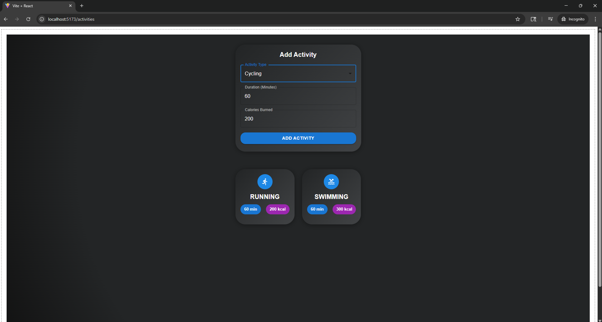

# 🏋️‍♂️ Fitness Tracker Microservices App

A full-stack, secure microservices-based fitness tracking platform featuring user management, activity logging, and AI-driven workout recommendations via Gemini API.  
Built with **Spring Boot**, **React**, **RabbitMQ**, **Keycloak OAuth2 PKCE**, **PostgreSQL**, and **MongoDB**.

---

## 🚀 Features

- 🔐 Secure authentication using **Keycloak** with **OAuth2 + PKCE**
- 🧍 User registration and validation (stored in **PostgreSQL**)
- 🏃‍♂️ Add activities like Running, Swimming etc. (stored in **MongoDB**)
- 💡 Real-time AI recommendations using **Gemini API**
- 🔁 Async messaging via **RabbitMQ** between services
- 🧠 AI Service consumes activity data and returns suggestions
- ☁️ Microservices registered via **Eureka Discovery Server**
- 🌉 API Gateway with token propagation and header mutation
- 🌐 Frontend built in **React + Vite** with PKCE login

---

## 🧱 Architecture Overview

```text
React (PKCE OAuth2)  -->  API-Gateway (Token extraction, ID mapping)
                                |
                                ↓
                        ┌───────────────┐
                        │               │
     PostgreSQL ←──── User-Service  ───→ Validates Keycloak ID
                        │
                        │
MongoDB ←──── Activity-Service  ──→ 📨 RabbitMQ (Activity Queue)
                                           ↓
                                   AI-Service (Consumes Queue)
                                   └── Gemini API (Recommendations)
                                           ↓
                                  Stores Results in MongoDB
📦 Tech Stack
Layer	Tech
Frontend	React, Vite, MUI
Authentication	Keycloak (OAuth2, PKCE)
Gateway	Spring Cloud Gateway
Microservices	Spring Boot (Java), WebClient
Messaging	RabbitMQ
Service Discovery	Eureka
Database	PostgreSQL (User), MongoDB (Others)
AI Integration	Gemini API via AI-Service

🔑 Authentication Flow
User logs in using PKCE-enabled Keycloak OAuth2.

Gateway extracts JWT token and sub (Keycloak ID).

Gateway validates/registers the user in user-service.

Internal UUID fetched & passed as X-User-ID to downstream services.

All microservices use internal UUID for secure, consistent user mapping.

🗃️ Data Flow
user-service: manages and validates users in PostgreSQL.

activity-service:

Accepts new activity logs (duration, type, calories)

Sends messages to activity-queue via RabbitMQ

ai-service:

Listens to activity-queue

Calls Gemini API for AI-based fitness suggestions

Saves recommendations in MongoDB (per user)

🧪 API & Postman
All endpoints are token-secured.

Use Bearer token generated via Keycloak.

Headers:

Authorization: Bearer <access_token>

X-User-ID: <mapped userId> (set by API Gateway internally)

📸 Demo Screenshots


### 🔑 OAuth2 Login & Authorization


### 📋 Activity Tracker UI


### 📡 Eureka Service Registry


🛠️ How to Run
🐳 Start services
bash
Copy
Edit
# Start Keycloak, RabbitMQ, MongoDB, PostgreSQL
docker-compose up -d

# Start Spring Boot services (Eureka, API Gateway, User, Activity, AI)
./mvnw spring-boot:run
🧠 Gemini API Key
Set your Gemini API key in the AI service config or environment:

env
Copy
Edit
GEMINI_API_KEY=your-key-here
✨ Improvements
Add Prometheus + Grafana monitoring

Rate-limit Gemini calls

Add admin dashboard

Integrate email login & verification in Keycloak

🤝 Credits
Built by Janardhan Reddy Guntaka for learning microservices, authentication, and real-time AI integration.

📜 License
MIT License – feel free to fork and build on top 🚀
